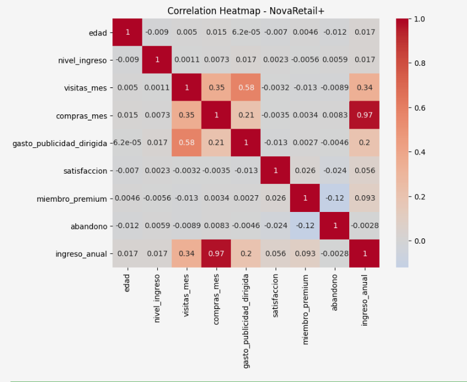
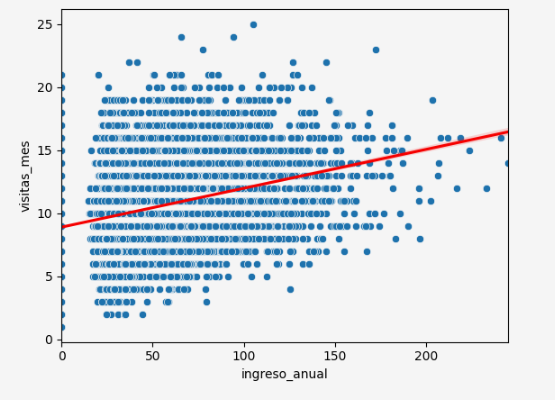
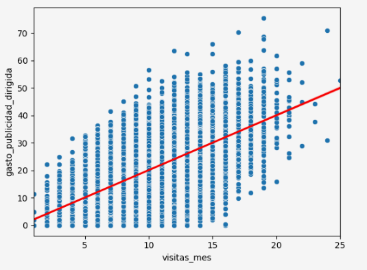

# 📈 NovaRetail+ Customer Behavior Correlation Analysis

This project analyzes customer behavior data for **NovaRetail+**, a Latin American e-commerce platform, to understand which behavioral factors are most strongly associated with **annual revenue generated by customers**.

The analysis follows a **correlational and exploratory approach**, combining visual analysis, statistical correlation methods, and responsible interpretation to identify meaningful business patterns without making incorrect causal assumptions.

---

## 📌 Business Objective

The Growth & Retention team at NovaRetail+ wanted to answer:

> **Which customer behavior factors are most strongly associated with annual revenue generation?**

The goal was to explore behavioral variables and identify meaningful patterns that may support future growth, retention, and experimentation strategies.

---

## 🛠 Tools & Technologies

- Python
- Pandas
- NumPy
- Seaborn
- Matplotlib
- SciPy
- Jupyter Notebook

---

## 🔍 Project Workflow

### 1. Data Exploration & Preparation

The analysis used a dataset containing **15,000 customer records** with behavioral, demographic, and commercial information, including:

- monthly visits
- purchases per month
- advertising spend
- satisfaction score
- premium membership
- churn behavior
- device type
- region
- annual customer revenue

Initial exploration included:

- dataset structure validation
- variable inspection
- type verification
- assumption documentation

---

### 2. Correlation Analysis

Different statistical methods were selected depending on variable type:

- **Pearson correlation** → linear relationships between numeric variables
- **Spearman correlation** → monotonic relationships
- **Point-biserial correlation** → binary vs numerical variables
- **Cramér’s V** → categorical relationships

This approach allowed more appropriate interpretation depending on data structure.

---

### 3. Visual Exploration

Heatmaps and scatterplots were used to visually explore customer behavior relationships and identify potential associations with annual revenue.

The analysis focused on understanding patterns while avoiding causal overinterpretation.

---

## 📊 Analysis Preview

### Global Correlation Heatmap

Global correlation analysis used to identify variables most strongly associated with customer annual revenue and behavioral metrics.

---

### Visits vs Annual Revenue

Scatterplot analysis exploring the relationship between customer visits and annual revenue generation.

Although a positive relationship exists, the analysis highlights that stronger activity does not necessarily imply proportional revenue growth.

---

### Advertising Spend vs Monthly Visits

Scatterplot used to evaluate the relationship between targeted advertising spend and customer engagement measured through monthly visits.

The results suggest a positive association, while emphasizing that correlation should not be interpreted as causation.

---

## 📈 Key Findings

- Customer behavior variables show different levels of association with annual revenue.
- Monthly visits and targeted advertising spend demonstrate positive relationships with customer activity.
- Premium membership presents only a weak association with annual revenue.
- Some variables appear related visually but require careful interpretation to avoid misleading conclusions.
- Correlational findings provide direction for future experimentation but do not establish causality.

---

## 💡 Business Implications

The results suggest opportunities to:

- improve traffic monetization strategies
- better understand conversion efficiency
- explore customer segmentation in greater depth
- design future A/B experiments to validate causal relationships

---

## ⚠️ Limitations

- The analysis is **correlational, not causal**.
- Relationships observed do not prove cause-effect mechanisms.
- Potential confounding variables may exist.
- No temporal component was included in the analysis.

---

## 🎯 Key Skills Demonstrated

- Exploratory Data Analysis (EDA)
- Correlation Analysis
- Statistical Interpretation
- Data Visualization
- Business Insights Development
- Responsible Data Interpretation

---

## 📓 Notebook

The full step-by-step analysis is available in the Jupyter Notebook included in this repository.

---

## 🔗 Portfolio

- Notion Portfolio: https://www.notion.so/NovaRetail-An-lisis-correlacional-del-comportamiento-del-cliente-36bddeb978468030999ffe2ff58339bc?source=copy_link
